Time Series Forecasting
================
Mansoor

Abstract
--------

The project involves developing models for forecasting the NN5 time series. NN5 32 time series is analysed to fit the best model among contender models. NN5 data set is explored and analysed using time series plots, seasonality analysis, auto correlation/ partial auto correlation plots and decomposition. Statistical test like KPSS, ADF, SMK and Cox Stuart test are conducted to study about the trend and stationarity of the series. Various models like Naive, Seasonal Naive, Moving average, Seasonal Exponential Smoothing (ANA, AAA, AAdA), Arima and Regression are fitted on the NN5 series and compared using error metrics like sMAPE, MAPE, MACE and SME. Rolling origin forecast with 6 origins is used to overcome the limitations of fixed origin forecasts.For the NN5 32 the best model achieved is Holt-Winters exponential smoothing model with damped trend (AAdA). Diagnostics are performed on the models by analysing the residuals. Finally back testing is performed on the series with various models using TSstudio package.

The NN5 series
--------------

The NN5 series dataset is part of the NN5 forecasting competition containing 11 and 111 time series of daily cash money demand at cash machines (ATMs) across different locations in England over a period of 2 years. The task is to develop forecasting models that can accurately predict the ATM cash withdrawals for the time series over a period of 2 weeks i.e. 14 days. Forecasting the cash demand is necessary to plan replenishing the ATM’s with adequate cash. Flawed forecasts lead to additional costs burden to the organisation which runs the ATM. If forecast is too high, unused money is stored in the ATM incurring cost to the organisation and if the forecast underestimates the demand then customers are dissatisfied which might lead to customer attrition. The NN5 time series data may reflect multiple overlying seasonality like weekly, monthly and yearly seasonality based on factors like location, holiday periods, special events and local factors. Based on these there may be structural breaks like level shifts, outliers and missing data. Hence one size fits all approach to the different series will not fetch the desired results and each of the series needs to have a specific customized model.

Forecast evaluation
-------------------

We evaluate the forecasts across a range of error metrics. We use scale dependent errors like MSE (Mean Squared Error), scale independent errors like MAPE (Mean Absolute Percentage Error) , Symmetric Mean Absolute Error (sMAPE) and relative errors like MASE (Mean Absolute Scaled Error) for comparing forecast across range of models. Both static and rolling origin forecasts are used.

``` r
#install.packages("webshot")
#webshot::install_phantomjs()
set.seed(1234)
# load libraries
library(forecast)
```

    ## Warning: package 'forecast' was built under R version 3.5.2

``` r
library(tseries)
library(tsutils)
```

    ## Warning: package 'tsutils' was built under R version 3.5.2

``` r
library(smooth)
```

    ## Loading required package: greybox

    ## Warning: package 'greybox' was built under R version 3.5.2

    ## Package "greybox", v0.4.1 loaded.

    ## This is package "smooth", v2.4.7

``` r
library(imputeTS)
```

    ## 
    ## Attaching package: 'imputeTS'

    ## The following object is masked from 'package:tseries':
    ## 
    ##     na.remove

``` r
library(car)
```

    ## Loading required package: carData

``` r
library(ggplot2)
library(stargazer)
```

    ## 
    ## Please cite as:

    ##  Hlavac, Marek (2018). stargazer: Well-Formatted Regression and Summary Statistics Tables.

    ##  R package version 5.2.2. https://CRAN.R-project.org/package=stargazer

``` r
library(xtable)
library(texreg)
```

    ## Version:  1.36.23
    ## Date:     2017-03-03
    ## Author:   Philip Leifeld (University of Glasgow)
    ## 
    ## Please cite the JSS article in your publications -- see citation("texreg").

``` r
library(utils)
library(Kendall)
library(trend)
library(TSstudio)
```

``` r
# data load with missing values repalced with NA
NN5_32<-read.csv("NN5_32_NA.csv", header=F,na.strings=("NA")) # data load

NROW(NN5_32)
```

    ## [1] 735

``` r
#NN5_32
#is.na(NN5_32)
# using imputeTS library to impute last observed carry forward value to replace NA
NN5_32<-na.locf(NN5_32, option = "locf")
#NN5_32
# And the forecasting horizon 2 weeks that is 14 days
h <- 14

# Create the training set
train_NN5_32 <- ts(NN5_32[1:721,],frequency=7) # converting into time series as well
#train_NN5_32
# Create the test set
test_NN5_32 <- ts(NN5_32[722:735,],frequency=7, start = c(104,1))
#test_NN5_32
```

``` r
#x11()
#exploratory
# ACF and PACF plotof intital data
NN5_32<-ts(NN5_32, frequency = 7)
tsdisplay(NN5_32, main = "ACF and PACF plots of NN5_32")
```

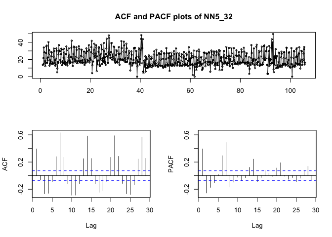

``` r
#autoplot(NN5_32, col='blue',lwd=1.2,main = "Time Series plot of ATM cash withdrawals - NN5_32", xlab = " Time in Weeks", ylab = 'ATM cash withdrawals')
ts_plot(NN5_32,title = "Time Series plot of ATM cash withdrawals - NN5_32", Xtitle = " Time in Weeks", Ytitle = 'ATM cash withdrawals')
```

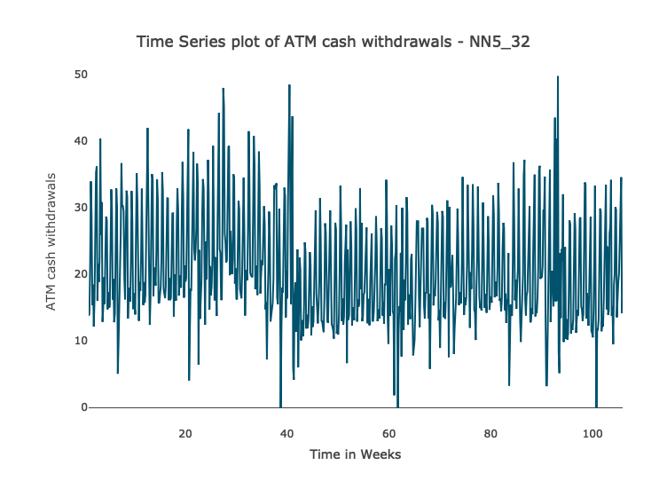

``` r
# seasonal plots
#x11()
seasplot(NN5_32) # says trend present
```

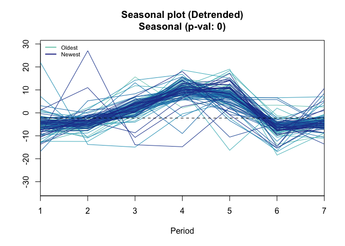

    ## Results of statistical testing
    ## Evidence of trend: TRUE  (pval: 0)
    ## Evidence of seasonality: TRUE  (pval: 0)

``` r
#seasonplot(NN5_32, col = rainbow(12), year.labels = TRUE) # seasonal plot of data # plot shows increasing withdrawals mid week
ts_seasonal(NN5_32, type = "all")
```

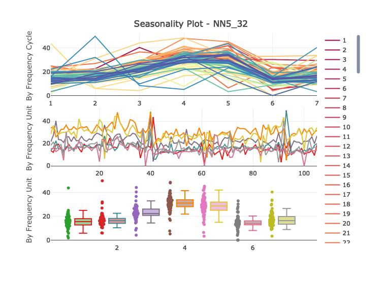

``` r
ts_lags(NN5_32, lags = 1:7)
```

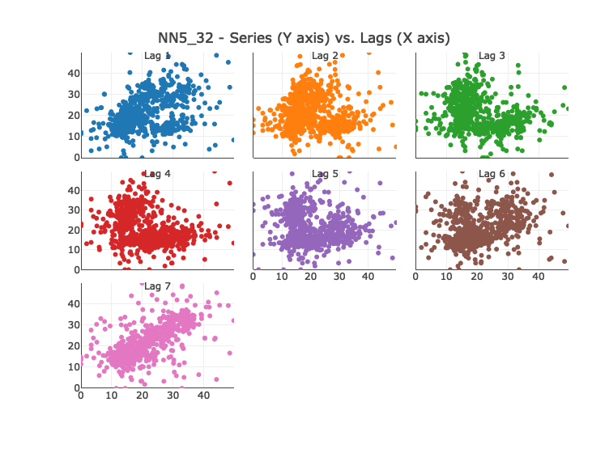

``` r
# decomposition of intital data
decomp_additive_NN5_32<-decomp(NN5_32,decomposition = "additive", outplot = TRUE)
```


``` r
decomp_multi_NN5_32<-decomp(NN5_32,decomposition = "multiplicative", outplot = FALSE)
#plot(decomp_additive_NN5_32$season)
#plot(decomp_multi_NN5_32$season) # plotting the seasonal data after decomposition
#plot(decomp_multi_NN5_32$irregular) # plotting irregular data(error) after decomposition
#plot(decomp_additive_NN5_32$trend, main="Trend plot of NN5_32 series", xlab="Time in weeks", ylab="ATM cash withdrawals") # plotting trend of data after decomposition

ts_decompose(NN5_32)
```

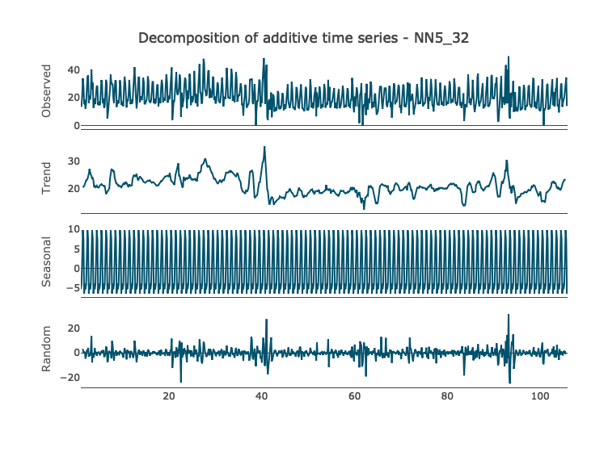

``` r
#(plot trend sepereately in this series becasue there is trend)
```

``` r
# data stationary test
kpss.test(NN5_32) # so data is not stationary
```

    ## Warning in kpss.test(NN5_32): p-value smaller than printed p-value

``` r
adf.test(NN5_32) # so data is stationary
```

    ## Warning in adf.test(NN5_32): p-value smaller than printed p-value

``` r
#kendalls test for trend
smk.test(NN5_32) #ho=data has no trend ha= data has trend, less than 0.01 reject null hypothesis and say data has trend.
# smk test says data has trend
#coxsmith test for trend
cs.test(NN5_32) #alternative hypothesis: monotonic trend
# trend present
trendtest(NN5_32, extract = "TRUE")
```

``` r
# naive method
naive_method_NN5_32 <- naive(train_NN5_32, h=14)# fitting naive method.
naive_method_NN5_32
forecast(naive_method_NN5_32) # forecasting naive
naive_forecast_NN5_32<-naive_method_NN5_32$mean # getting the values of the forecast
naive_forecast_NN5_32
# calculating synthetic Mean Absolute Percent Error (sMAPE) # use other accuray measures. write up abt formula from link in the coursework bookmark folder
# errors=testdata-forecast
naive_errors1<-abs(test_NN5_32-naive_forecast_NN5_32)
naive_errors1
# testdata+forecast
naive_errors2<-abs(test_NN5_32)+abs(naive_forecast_NN5_32)
naive_errors2

#sMAPE formula
naive_sMAPE <- mean(2*naive_errors1/(naive_errors2))
naive_sMAPE #(0.369)
# using smooth package
SMAPE(test_NN5_32,naive_forecast_NN5_32,3)
MAPE(test_NN5_32,naive_forecast_NN5_32,3) # 0.310
MSE(test_NN5_32,naive_forecast_NN5_32,3) #96.451
#MACE(test_NN5_32,naive_forecast_NN5_32,3)
```

``` r
#x11()
#plot(forecast(naive_method_NN5_32),lwd=2, main = "Naive Forecast of NN5_32",xlab = "Time in weeks",ylab = "Cash Withdrawals") # plotting the naive forecasting
test_forecast(actual = NN5_32, forecast.obj = forecast(naive_method_NN5_32), test = test_NN5_32)
```

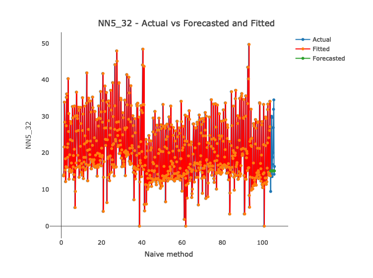

``` r
#lines(fitted(naive_method_NN5_32))
# write x lab and y lab. and plot the enlarged screenshot of the forecacast.
```

``` r
# seasonal naive
snaive_method_NN5_32<-snaive(train_NN5_32,h=14)# seasonal naive
snaive_forecast_NN5_32<-snaive_method_NN5_32$mean # getting the forecast values
snaive_forecast_NN5_32
snaive_method_NN5_32

# calculating Mean Absolute Percent Error (MAPE)
# errors=testdata-forecast
snaive_errors1<-abs(test_NN5_32-snaive_forecast_NN5_32)
snaive_errors1
# testdata+forecast
snaive_errors2<-abs(test_NN5_32)+abs(snaive_forecast_NN5_32)
#MAPE formula
snaive_MAPE <- mean(2*(snaive_errors1)/(snaive_errors2))
snaive_MAPE #(0.156)
# using smooth package
SMAPE(test_NN5_32,snaive_forecast_NN5_32,3) #0.1561
MAPE(test_NN5_32,snaive_forecast_NN5_32,3) #0.1560
MSE(test_NN5_32,snaive_forecast_NN5_32,3) #13.211
#MACE(test_NN5_32,snaive_forecast_NN5_32,3)
```

``` r
#x11()
#plot(forecast(snaive_method_NN5_32),lwd=2, main = "Seasonal Naive Forecast of NN5_32",xlab = "Time in weeks",ylab = "Cash Withdrawals")
test_forecast(actual = NN5_32, forecast.obj = forecast(snaive_method_NN5_32), test = test_NN5_32)
```

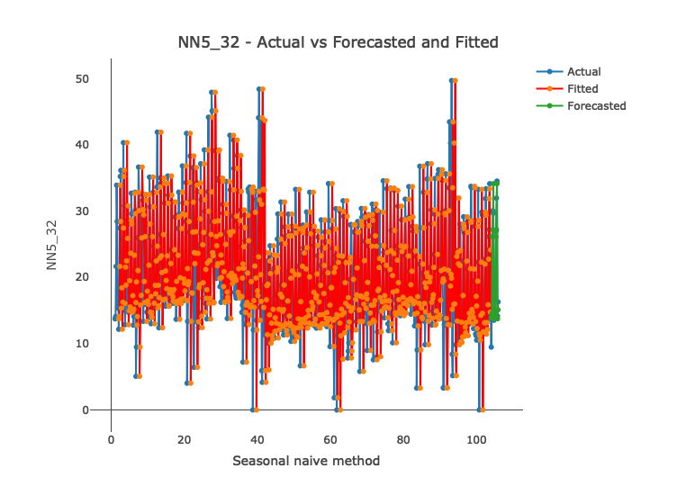

``` r
# finding the centred moving average
NN5_32_cma <- cmav(NN5_32, ma = 7, fill = FALSE)
#NN5_32_cma
#Plot the original time series in blue
plot(NN5_32, col="blue",lwd=2,main = "Centred Moving Average of NN5_32", xlab = " Time in Weeks", ylab = 'ATM cash withdrawals' )
#Plot the CMA(12) in red
lines(NN5_32_cma,lwd=2, col = "red") # plotting CMA over the data
```

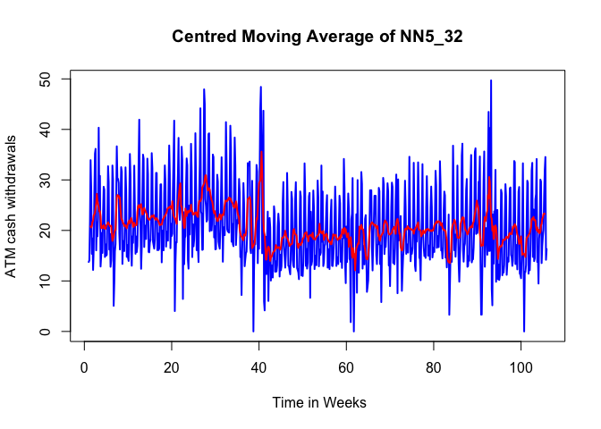

``` r
# Firstly we get rid of NA (‘‘Not Assigned’’) values:
SMA_no_NAs <- NN5_32_cma[!is.na(NN5_32_cma)]
SMA_forecast <- ts(rep(SMA_no_NAs[length(SMA_no_NAs)],14), frequency=7, start = c(104,1)) # to calculate errors of sma
SMA_forecast
SMA_errors <- test_NN5_32 - SMA_forecast
SMA_errors
SMAPE(test_NN5_32,SMA_forecast) #0.33
MAPE(test_NN5_32,SMA_forecast) #0.33
#MACE(test_NN5_32,SMA_forecast)#0.401
MSE(test_NN5_32,SMA_forecast)# 58.808
```

``` r
# auto exponential smoothing to select model
es_NN5_32_auto<-es(train_NN5_32,intitial='b', model='ZZZ')
es_NN5_32_auto # gives ANA model even though trend is present

# use intital values looking at the class lecture notes
es_NN5_32<-es(train_NN5_32,intitial='b', model=c('ANA','MNA','ANM'))
```

    ## Warning: Can't apply multiplicative model to non-positive data. Switching
    ## to additive.

``` r
es_NN5_32 # model suggested is 'ANA' AIC=4445 alpha=0.08
summary(es_NN5_32)
forecast_es<-forecast(es_NN5_32, h=14)
forecast_es$mean
forecast_es
forecast_es$forecast

# calculating Mean Absolute Percent Error (MAPE)
es_errors1<-abs(test_NN5_32-forecast_es$mean)
es_errors1
# testdata+forecast
es_errors2<-abs(test_NN5_32)+abs(forecast_es$mean)
#MAPE formula
es_MAPE <- mean(2*(es_errors1)/(es_errors2))
es_MAPE #(0.124)
# using smooth package
SMAPE(test_NN5_32,forecast_es$mean,3)
MAPE(test_NN5_32,forecast_es$mean,3)
MSE(test_NN5_32,forecast_es$mean,3) #10.344
#MACE(test_NN5_32,forecast_es$mean,3) # its not working so take from mace below
```

``` r
plot(forecast_es,main = "Exponential smoothing Forecast of NN5_32 with season and no trend (ANA) model",xlab = "Time in weeks",ylab = "Cash Withdrawals") # plot of exponential smmothing model
```


``` r
#with hold out for finding accuracy in exponetial smoothing
NN5_32_h<-ts(NN5_32, frequency = 7)
es_NN5_32_h<-es(NN5_32_h, model='ANA', h=14,holdout = TRUE)# define hold out # set seed # put automatic model as well
es_NN5_32_h
es_NN5_32_h$accuracy # MAPE accuracy is 38.6%. 
# so now manually fit model with ANA(additive, no trend, seasonality) and MNA (multiplicative, no trend, seasonality)
# can also include alpha=0.17 in the model. 0.17 got from the zzz model
#also use intital = 'b'
```

``` r
# Holt winters method for exponential smoothing
hw_es<-ets(train_NN5_32,model = "AAA",damped = FALSE,alpha = 0.1, beta = 0.1, gamma = 0.35) # others-(AAdA),AAM,MAM
hw_es
# to put in values intitally ---(alpha = 0.1, beta = 0.1, gamma = 0.35)
forecast_hw_es<-forecast(hw_es, h=14)
forecast_hw_es
#plot(forecast_hw_es,lwd=2,main = "Holt-winters Exponential smoothing Forecast of NN5_32 with trend and season (AAA)",xlab = "Time in weeks",ylab = "Cash Withdrawals") # takes level shift as trend if we take AAA. does not give proper forecast
#lines(test_NN5_32, col="purple", lwd=2)
#legend("bottomleft",c("Train data NN5_32","Test data NN5_32","Forecast from exponential smoothing (AAA) model"),fill=c("black","purple","blue" ))
```

``` r
test_forecast(actual = NN5_32, forecast.obj = forecast_hw_es, test = test_NN5_32)
```

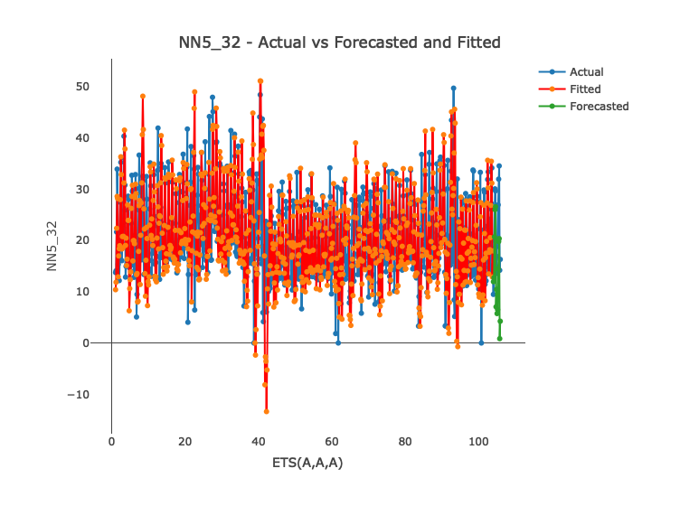

``` r
# calculating Mean Absolute Percent Error (MAPE)
# errors=testdata-forecast
hw_es_errors1<-abs(test_NN5_32-forecast_hw_es$mean)
hw_es_errors1
# testdata+forecast
hw_es_errors2<-abs(test_NN5_32)+abs(forecast_hw_es$mean)
#MAPE formula
hw_es_MAPE <- mean(2*(hw_es_errors1)/(hw_es_errors2))
hw_es_MAPE #(0.614) with damped false
hw_es_MAPE #(0.199) with damped true
hw_es_MAPE # (0.122) with no apha beta gamma values put in
# using smooth package
SMAPE(test_NN5_32,forecast_hw_es$mean,3)#0.615 write all 3 models of holt winters errors
MAPE(test_NN5_32,forecast_hw_es$mean,3)#0.429
MSE(test_NN5_32,forecast_hw_es$mean,3) #95.098
MASE(test_NN5_32,forecast_hw_es$mean,3) #2.852
```

``` r
# Holt winters method for exponential smoothing with damped trend
hw_es_D<-ets(train_NN5_32,model = "AAA",damped = TRUE) # others-(AAdA),AAM,MAM
hw_es_D

forecast_hw_es_D<-forecast(hw_es_D, h=14)
forecast_hw_es_D
#plot(forecast_hw_es_D,lwd=2,main = "Holt-winters Exponential smoothing Forecast of NN5_32 with DAMPED trend and season (AAA)",xlab = "Time in weeks",ylab = "Cash Withdrawals") # takes level shift as trend if we take AAA. does not give proper forecast
#lines(test_NN5_32, col="purple", lwd=2)
#legend("bottomleft",c("Train data NN5_32","Test data NN5_32","Forecast from exponential smoothing (AAA) model"),fill=c("black","purple","blue" ))
```

``` r
test_forecast(actual = NN5_32, forecast.obj = forecast_hw_es_D, test = test_NN5_32)
```

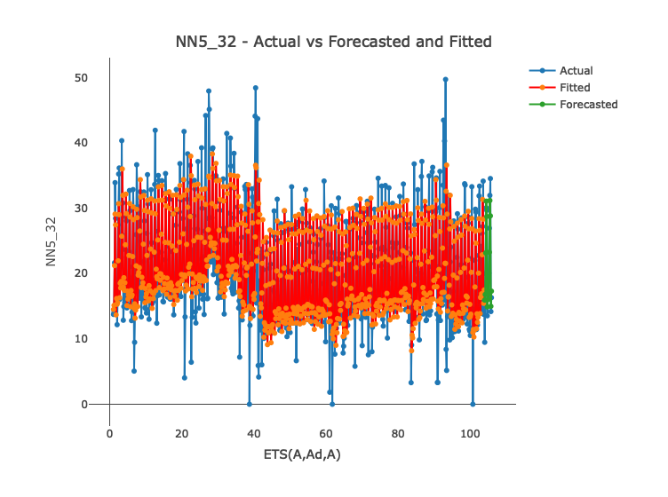

``` r
# calculating Mean Absolute Percent Error (MAPE)
# errors=testdata-forecast
hw_es_D_errors1<-abs(test_NN5_32-forecast_hw_es_D$mean)
hw_es_D_errors1
# testdata+forecast
hw_es_D_errors2<-abs(test_NN5_32)+abs(forecast_hw_es_D$mean)
#MAPE formula
hw_es_MAPE_D <- mean(2*(hw_es_D_errors1)/(hw_es_D_errors2))
hw_es_MAPE_D #(0.122)
# using smooth package
SMAPE(test_NN5_32,forecast_hw_es_D$mean,3)#0.123
MAPE(test_NN5_32,forecast_hw_es_D$mean,3)
MSE(test_NN5_32,forecast_hw_es_D$mean,3) #8.88
MASE(test_NN5_32,forecast_hw_es_D$mean,3) #0.78
```

``` r
#ARIMA
# manual selection of seasonal arima model using box genkins methodology
# check AIC at each step to find best model

# fit auto.arima
fit_auto_NN5_32<-auto.arima(train_NN5_32)
summary(fit_auto_NN5_32) # model suggested is ARIMA(0,0,2)(0,1,1)

# auto SARIMA using smooth package
Sarima_auto<-auto.ssarima(train_NN5_32,h=14, holdout = FALSE) # auto state space ARIMA
Sarima_auto #gives 002,311 model
#x11()
```

``` r
tsdisplay(residuals(Sarima_auto))
```

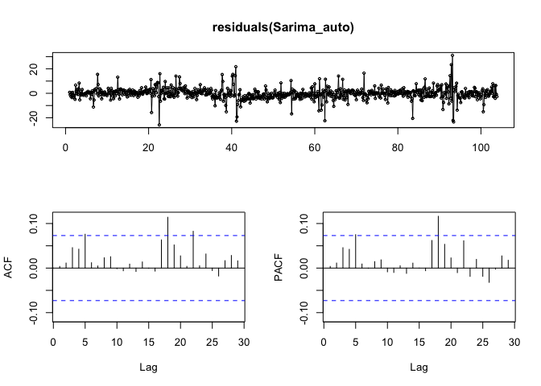

``` r
#x11()
# Plot seris, ACF and PACF of the residuals of auto arima
tsdisplay(residuals(fit_auto_NN5_32))
```


``` r
#note: do lunjung bung test statistics, qqplot of residuals etc
# Fitted values of auto.arima
#plot(fitted(fit_auto_NN5_32))

# forecast absed on autoarima model
A<-forecast(fit_auto_NN5_32, h=14)
A$mean

# calculating Mean Absolute Percent Error (MAPE)
# errors=testdata-forecast
auto_arima_error1<-abs(test_NN5_32-A$mean)
auto_arima_error1
auto_arima_error2<-abs(test_NN5_32)+abs(A$mean)
auto_arima_error2  

#MAPE formula
auto_arima_MAPE <- mean(2*(auto_arima_error1)/(auto_arima_error2))
auto_arima_MAPE #auto.SARIMA ACCURACY 0.122 AUTO.ARIMA 0.130
plot(A) # plot of auto arima model
```

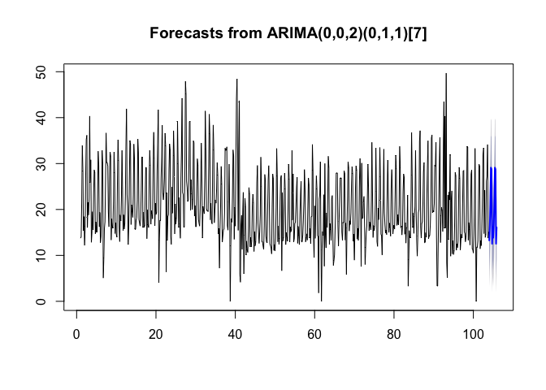

``` r
A # point foreacst
#fit_auto_NN5_12$arma
SMAPE(test_NN5_32,A$mean,3) # AUTO.SARIMA-0.122 AUTO.ARIMA 0.131
MAPE(test_NN5_32,A$mean,3)# auto.sarima 0.12 auto.arima 0.127
MSE(test_NN5_32,A$mean,3) # AUTO.SARIMA 9.61 AUTO.ARIMA 9.829
MASE(test_NN5_32,A$mean,3) # AUTO.SARIMA 0.808 AUTO.ARIMA 0.836

# to check diffrencing required for making seasonality stationary
nsdiffs(train_NN5_32,test = "seas") # it gives 1 diff requires # see the help package and write about it. about default test"seas".and other tests
# to check if diffrencing required for non seasonality of series to be stationary
ndiffs(train_NN5_32, test = "kpss") # it gives 1 diffrencing required FOR NON SEASONAL PART TOO.

tsdisplay(train_NN5_32)
```

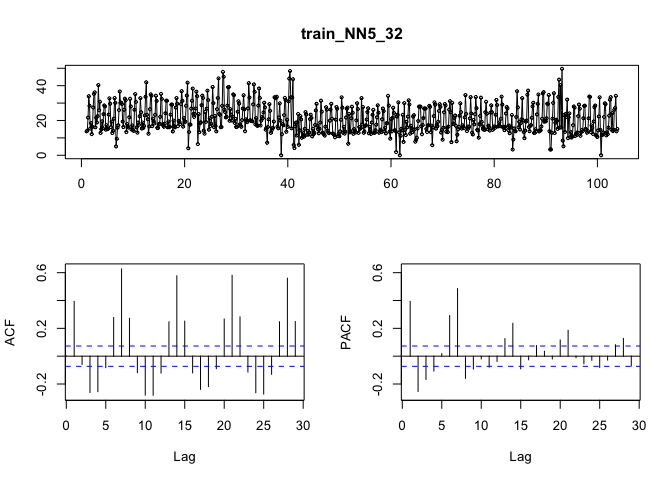

``` r
#tsdisplay(diff(train_NN5_12, lag=7)) # plotting ts display with 1 seasonal #diffrencing

fit1_manual_arima <- Arima(train_NN5_32, order=c(0,0,0), seasonal=list(order=c(0,1,0)))
summary(fit1_manual_arima)
tsdisplay(residuals(fit1_manual_arima))
```


``` r
fit2_manual_arima <- Arima(train_NN5_32, order=c(0,1,0), seasonal=list(order=c(0,1,0)))
summary(fit2_manual_arima)
tsdisplay(residuals(fit2_manual_arima)) 
```


``` r
# CHECKED IF DIFFERENCING ON NON SEASONAL PART HELPS. IT DOSESNT. AIC GOES TO #5026.55 AND TS DISPLAY GOES HAYWIRE. SO WILL NOT DIFFERENCE NON #SEASNSOALITY.

fit3_manual_arima <- Arima(train_NN5_32, order=c(0,0,0), seasonal=c(0,1,2))
summary(fit3_manual_arima)
tsdisplay(residuals(fit3_manual_arima))
```


``` r
fit4_manual_arima <- Arima(train_NN5_32, order=c(1,0,0), seasonal=c(0,1,2))
summary(fit4_manual_arima)
tsdisplay(residuals(fit4_manual_arima)) # THERE IS AN BIG OUTLIER SO ONE OR #TWO LINES SIGNIFICANT
```

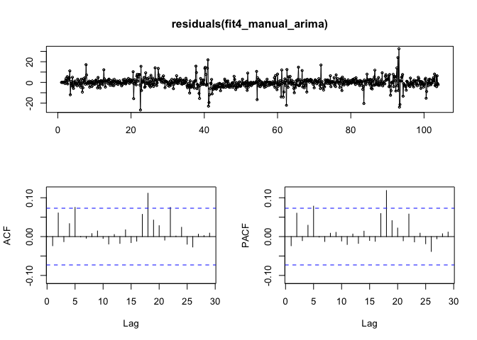

``` r
# forecasting fit 6
f_fit5<-forecast(fit4_manual_arima, h=14)
f_fit5
# errors for the mape formula
manual_fit5_error1<-abs(test_NN5_32-f_fit5$mean)
manual_fit5_error2<-abs(test_NN5_32)+abs(f_fit5$mean)

#MAPE formula
fit5_arima_MAPE <- mean(2*(manual_fit5_error1)/(manual_fit5_error2))
fit5_arima_MAPE #(0.129) 
```

``` r
test_forecast(actual = NN5_32, forecast.obj = f_fit5, test = test_NN5_32)
```

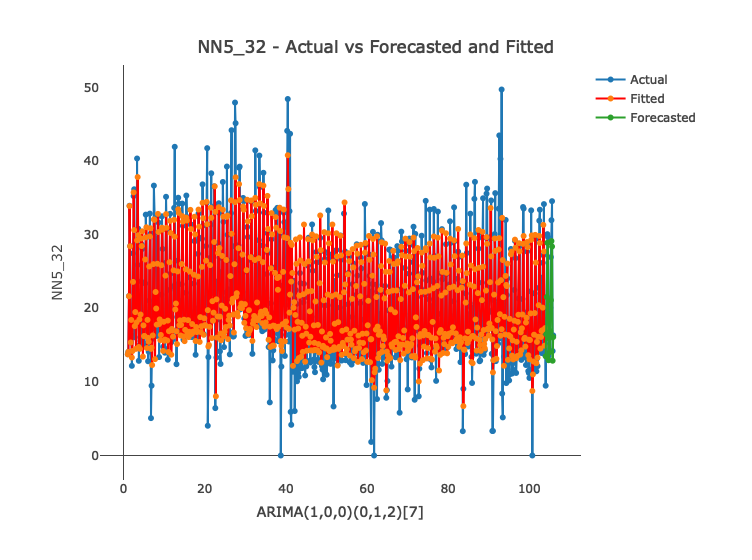

``` r
plot(f_fit5, lwd=1.5,xlab = "Time in weeks",ylab = "Cash Withdrawals") # plot of best arima model
lines(fitted(fit3_manual_arima), lty="dashed",col="purple")
legend("topleft",c("Series NN5_32","fitted values of the model","Point forecast"),
       fill=c("black","purple","blue" ))
```


``` r
SMAPE(test_NN5_32,f_fit5$mean,3)#0.129
MAPE(test_NN5_32,f_fit5$mean,3) #0.127
MSE(test_NN5_32,f_fit5$mean,3) # 10.054
MASE(test_NN5_32,f_fit5$mean,3) #0.843
```

``` r
plot(f_fit5$mean, col="red",lwd=2,main="Test data overlapped with the Arima forecast",xlab="time in weeks", ylab=" Cash withdrawals")
lines(test_NN5_32, col="blue",lwd=2)
legend("bottomright",c("test data NN5_32","Forecast from ARIMA model"),fill=c("blue","red" ))
```


``` r
#Extract Residuals
fit1_arima_resid <- residuals(fit4_manual_arima)
#Extract Residuals
fit1_arima_fitted <- fitted(fit4_manual_arima)
```

``` r
#Plot Histogram and qq plot to check for normality of the residuals
hist(fit1_arima_resid, main="Residuals Arima Model-NN5_32")
```


``` r
#QQ-Plot
qqnorm(fit1_arima_resid, main = "QQ plot Residuals")
qqline(fit1_arima_resid, lwd=2, col="blue")
```


``` r
# all of them give residuals not normally distributed.so what to do??
#statistical test for normality of residuals.The null hypothesis in all of them is that the residuals are distributed normally.
#Jarque-Bera test
jarque.bera.test(fit1_arima_resid) #p value less that 0.05 so reject null hypothesis

#Shapiro-Wilk test

shapiro.test(fit1_arima_resid) # p value less that 0.05 so reject null hypothesis

#Kolmogorov-Smirnov test
ks.test(fit1_arima_resid,y="rnorm")
```

``` r
# constant variance aasumption-variability of residuals in all the parts of the plot should be the same
#homoscedastic
#Plot Residuals against Fitted Values
plot(fit1_arima_fitted, fit1_arima_resid, main="Residuals vs Fitted values")
```


``` r
#Plot Residuals against Fitted Values
plot(fit1_arima_fitted, fit1_arima_resid^2)
```

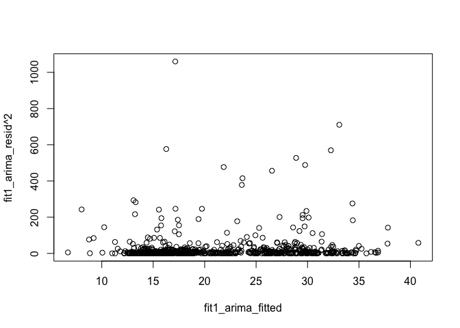

``` r
#Plot Residuals Against all X Variables
#pairs(fit1_arima_resid ~ ., data=train_NN5_32)#--- not working
```

``` r
# Plot Residuals against Time-- how the residuals vary over time:
plot(fit1_arima_resid, type="l", main=" Residuals across time") # it hink huge cash withdrawals at end of year
# Draw the Mean Line at 0 in Blue
abline(h=0, col="blue")
```

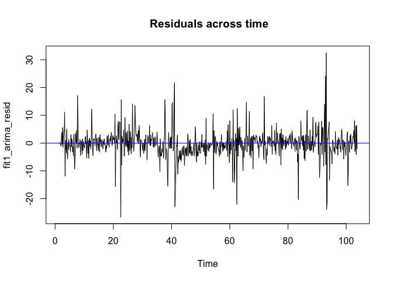

``` r
#outlier detection
# Create Studentised Residuals
#fit1_arima_resid_st <- rstandard(fit3_manual_arima) #doesnt work
# Plot the Residuals
#plot(fit1_arima_resid_st)
# Draw two horizontal lines at 2 and -2 in red
#abline(h=c(-2,2),col="red")
```

``` r
#regression

# data load with missing values repalced with NA
NN5_32<-read.csv("NN5_32_NA.csv", header=F,na.strings=("NA")) # data load

#NROW(NN5_12)
#NN5_12
#is.na(NN5_12)

# using imputeTS library to impute last observed carry forward value to replace NA
NN5_32<-na.locf(NN5_32, option = "locf")
NN5_32

colnames(NN5_32)<-c("with")

# defining time series
NN5_32<-ts(NN5_32, frequency = 7,start = c(1,1))
NN5_32

#Create Seasonal Dummies
d1 <- rep(c(1,0,0,0,0,0,0),105)
d2 <- rep(c(0,1,0,0,0,0,0),105)
d3 <- rep(c(0,0,1,0,0,0,0),105)
d4 <- rep(c(0,0,0,1,0,0,0),105)
d5 <- rep(c(0,0,0,0,1,0,0),105)
d6 <- rep(c(0,0,0,0,0,1,0),105)
d7 <- rep(c(0,0,0,0,0,0,1),105)

# binding seasonal dummies with full dataset

NN5_32<-cbind(NN5_32,d1,d2,d3,d4,d5,d6)
colnames(NN5_32)<-c("with","d1","d2","d3","d4","d5","d6")
NN5_32

#Lag  of withdrawals
L1_with <- stats::lag(NN5_32[,"with"],-1)
L2_with <- stats::lag(NN5_32[,"with"],-2)
L3_with <- stats::lag(NN5_32[,"with"],-3)
L4_with <- stats::lag(NN5_32[,"with"],-4)
L5_with <- stats::lag(NN5_32[,"with"],-5)
L6_with <- stats::lag(NN5_32[,"with"],-6)
L7_with <- stats::lag(NN5_32[,"with"],-7)
L7_with


# creating full data set with lags and seasonal dummies
NN5_32<-cbind(NN5_32,L1_with,L2_with,L3_with,L4_with,L5_with,L6_with,L7_with)
colnames(NN5_32)<-c("with","d1","d2","d3","d4","d5","d6","l1","l2","l3","l4","l5","l6","l7")

# creating train and test set with the full dataset with seaonal and lag variables
train_NN5_32<-window(NN5_32,start=c(1,1),end=c(103,7))
train_NN5_32

test_NN5_32<-window(NN5_32,start=c(104,1),end=c(105,7))
test_NN5_32

# fit with null model
fit0<-lm(with~1, data = train_NN5_32)
summary(fit0)

# fit with full dataset
fit1<-lm(with~., data = train_NN5_32)
summary(fit1)

# use back propagation and step to reach final model
fit1<-step(fit1)
summary(fit1) # ALTHOUGH SEASONAL DUMMIES ARE ONLY D1 AND D2 ARE MISSING WE STILL HAVE TO TKE THEM
# LAGS 1,2,5,7
vif(fit1)
tsdisplay(residuals(fit1), main = "Residuals of regression model on NN5_32") # ftted residuals HAVE SIMILAR SPIKES AS ARIMA MODEL BECASUE THERE IS AN OUTLIER
```


``` r
#Regression Coefficients
coef(summary(fit1))

#Extract Residuals
fit1_resid <- residuals(fit1)
#Extract Residuals
fit1_fitted <- fitted(fit1)
```

``` r
tsdisplay(residuals(fit1), main = "Residuals of regression model on NN5_32")
```

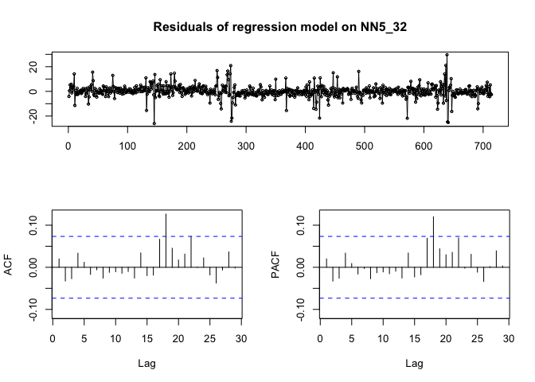

``` r
#Plot Histogram and qq plot to check for normality of the residuals
hist(fit1_resid, main = "Residuals of regression model NN5_32")
```

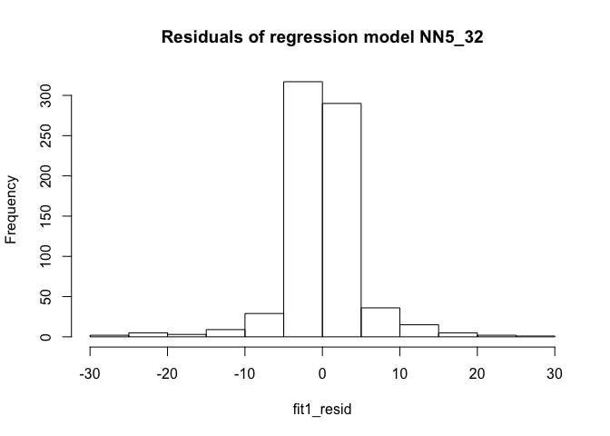

``` r
#QQ-Plot
qqnorm(fit1_resid, main = "QQ plot of residuals")
qqline(fit1_resid, lwd=2, col="blue")
```


``` r
# all of them give residuals not normally distributed.so what to do??
#statistical test for normality of residuals.The null hypothesis in all of them is that the residuals are distributed normally.
#Jarque-Bera test
jarque.bera.test(fit1_resid) #p value less that 0.05 so reject null hypothesis

#Shapiro-Wilk test

shapiro.test(fit1_resid) # p value less that 0.05 so reject null hypothesis

#Kolmogorov-Smirnov test
ks.test(fit1_resid,y="rnorm")
```

``` r
# constant variance aasumption-variability of residuals in all the parts of the plot should be the same
#homoscedastic
#Plot Residuals against Fitted Values
plot(fit1_fitted, fit1_resid, main="Residuals vs Fitted values")
```


``` r
#Plot Residuals against Fitted Values
plot(fit1_fitted, fit1_resid^2, main = "Squared residuals vs fitted value")
```


``` r
#Plot Residuals Against all X Variables
#pairs(fit1_resid ~ ., data=train_NN5_32)#--- not working

# Plot Residuals against Time-- how the residuals vary over time:
plot(fit1_resid, type="l",main=" Residuals across time") # it hink huge cash withdrawals at end of year
# Draw the Mean Line at 0 in Blue
abline(h=0, col="blue")
```

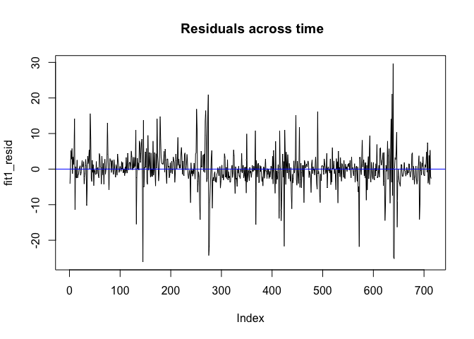

``` r
#outlier detection
# Create Studentised Residuals
fit1_resid_st <- rstandard(fit1)
# Plot the Residuals
plot(fit1_resid_st, main = "outliers")
# Draw two horizontal lines at 2 and -2 in red
abline(h=c(-2,2),col="red")
```

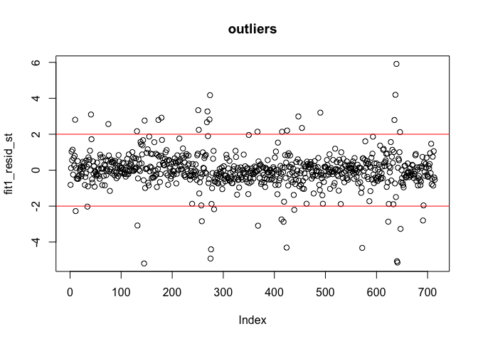

``` r
# forecasting on regression

#Forecast from Model 1
fitfullForecast <- predict(fit1, test_NN5_32)
fitfullForecast

#par(mfrow=c(1,2))
#x11()
#plot(test_NN5_12[,"with"],lwd=2, col="green") # try to get one over the other

#plot(fitfullForecast,type = 'l', col="red",lwd=2,main="Test data overlapped with the Regression forecast",xlab="time in weeks", ylab=" Cash withdrawals")
#lines(test_NN5_12[,"with"], col="blue",lwd=2)

fitfullForecast<-ts(fitfullForecast,frequency = 7, start = c(104,1))
```

``` r
plot(train_NN5_32[,"with"],lwd=2,main="Regression model forecast - NN5_32",xlab="time in weeks", ylab=" Cash withdrawals")
lines(ts(fit1_fitted, frequency = 7, start = c(1,1)), lty="dashed", col="purple")
lines(test_NN5_32[,"with"],lwd=2, col="red")
lines(fitfullForecast, col="blue", lwd=2)
```

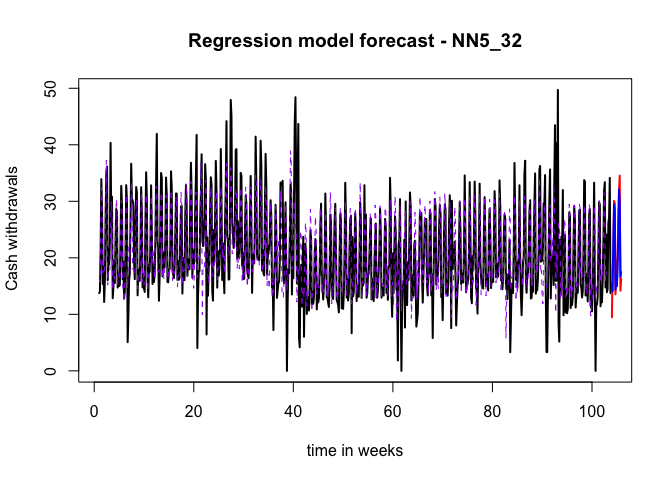

``` r
#legend("bottom",c("Train data NN5_32","Test data NN5_32","Forecast from regression model", "Fitted values"),fill=c("black","red","blue","purple" ))
```

``` r
reg_error1<-abs(test_NN5_32[,"with"]-fitfullForecast)
reg_error2<-abs(test_NN5_32[,"with"])+abs(fitfullForecast)
reg_sMAPE <- mean(2*(reg_error1)/(reg_error2))
reg_sMAPE #(0.137)

SMAPE(test_NN5_32[,"with"],fitfullForecast,3) #0.137
MAPE(test_NN5_32[,"with"],fitfullForecast,3)
MSE(test_NN5_32[,"with"],fitfullForecast,3) #9.502
MASE(test_NN5_32[,"with"],fitfullForecast,3) #0.835

#Forecast from Model 1
fit1fullForecast_ <- predict(fit1, test_NN5_32,
                             interval="prediction", level=0.95)
fit1fullForecast_

```
## Backtesting forecasts across different models
We use TSstudio package to perform backtesting of NN5 32 series across a range of model namely auto.arima, HoltWinters, exponential smoothing, Neural network (nnetar), TBATS, BSTS (Bayesian structural time series) and hybrid.

