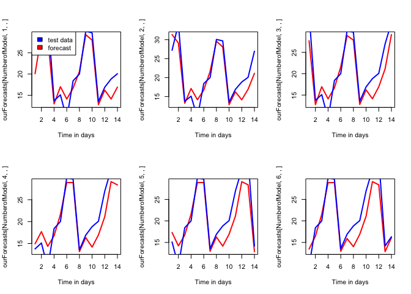

Rolling Origin Forecasting
================
Mansoor

Rolling Origin forecast overcomes the limitations in the static origin forecast by providing more forecasts per origin and overcome strange origins.

Rolling origin forecasts of the exponential smoothing models
------------------------------------------------------------

We fit rolling origin forecast with 6 origins on the Holt -Winters exponential smoothing model with damped trend (AAdA) for the NN5 32 series. sMAPE errors for the 6 rolling origin forecasts for NN5 32 are 0.139, 0.132, 0.142, 0.129, 0.128 and 0.126 with t+6 origin giving the lowest errors and the mean of errors as 0.133.

``` r
# load libraries
library(webshot) # for getting html inot github_documents

library(forecast)
library(tseries)
library(tsutils)
library(smooth)
library(imputeTS)
library(car)
library(ggplot2)
library(stargazer)
library(xtable)
library(texreg)
library(utils)
library(Kendall)
library(trend)
library(TSstudio)

NN5_32<-read.csv("NN5_32_NA.csv", header=F,na.strings=("NA"))  

# using imputeTS library to impute last observed carry forward value to replace NA
NN5_32<-na.locf(NN5_32, option = "locf")
NN5_32<-ts(NN5_32, frequency = 7)


# Parameter setting
origins <- 6    # We would like to predict for 6 rolling origins
ourHorizon <- 14
NumberofModel <- 1    # You can generalize this code for more models

#Create two NA arrays for loading the results
ourForecasts <- array (NA,c(NumberofModel, origins, ourHorizon, ncol(NN5_32)))
ourHoldouts  <- array  (NA,c(origins, ourHorizon, ncol(NN5_32)))
# Double loop
for (i in 1:ncol(NN5_32)) {
  for (j in 1:origins )     {
    ourData <- NN5_32 [,i]
    ourData <- ts(ourData,frequency=7)
    datalength <- length (ourData)
    trainlength <- datalength - ourHorizon - origins + 1
    datatest <- ourData [(trainlength + 1): datalength]
    ourtrainset <- ts (ourData [ 1:(trainlength+j-1) ], frequency=7, start=start(ourData))
    ourHoldouts [j,,i] <- datatest [j-1+(1:ourHorizon)]
    # Produce forecasts
    #ourModel<-Arima(ourtrainset,order=c(1,0,0), seasonal=list(order=c(0,1,2)))
    ourModel <- es(ourtrainset,"AAdA", h= ourHorizon, silent=TRUE)
    #ourForecasts [NumberofModel,j,,i] <- ourModel$forecast }}
    ourForecasts [NumberofModel,j,,i] <- forecast(ourModel, h=ourHorizon)$mean }}

ourHoldouts
ourForecasts
```

``` r
#plot of all the foreacst and the test data with different origins
par(mfrow=c(2,3))
plot(ourForecasts[NumberofModel,1,,], type = "l", col="red",lwd=2,xlab = "Time in days")
lines(ourHoldouts[1,,], col="blue", lwd=2)
#legend("topleft",c("test data","forecast"),fill=c("blue","red" ))
plot(ourForecasts[NumberofModel,2,,], type = "l", col="red",lwd=2,xlab = "Time in days")
lines(ourHoldouts[2,,], col="blue", lwd=2)
plot(ourForecasts[NumberofModel,3,,], type = "l", col="red",lwd=2,xlab = "Time in days")
lines(ourHoldouts[3,,], col="blue", lwd=2)
plot(ourForecasts[NumberofModel,4,,], type = "l", col="red",lwd=2,xlab = "Time in days")
lines(ourHoldouts[4,,], col="blue", lwd=2)
plot(ourForecasts[NumberofModel,5,,], type = "l", col="red",lwd=2,xlab = "Time in days")
lines(ourHoldouts[5,,], col="blue", lwd=2)
plot(ourForecasts[NumberofModel,6,,], type = "l", col="red",lwd=2,xlab = "Time in days")
lines(ourHoldouts[6,,], col="blue", lwd=2)
```


``` r
#For improving the execution time of your coding, you can use sapply() function in R
#calculate the sMAPE
qq<-abs(ourHoldouts[,,]-ourForecasts[NumberofModel,,,])
bb<-(abs(ourHoldouts[,,])+abs(ourForecasts[NumberofModel,,,]))/2
zzznn <- colMeans(qq/bb)
(zzznn)
```

    ##  [1] 0.18156112 0.16679709 0.16722211 0.13393228 0.14429071 0.11860009
    ##  [7] 0.06931046 0.07614474 0.08906246 0.13326727 0.12133395 0.16655139
    ## [13] 0.15848716 0.12850823

``` r
mean(zzznn)
```

    ## [1] 0.1325049

``` r
#smape of each forecast of the 6 origins
SMAPE(ourHoldouts[1,,],ourForecasts[NumberofModel,1,,])#0.345, 0.384,0.388, 0.358, 0.418, 0.405
```

    ## [1] 0.139

``` r
SMAPE(ourHoldouts[2,,],ourForecasts[NumberofModel,2,,])
```

    ## [1] 0.132

``` r
SMAPE(ourHoldouts[3,,],ourForecasts[NumberofModel,3,,])
```

    ## [1] 0.142

``` r
SMAPE(ourHoldouts[4,,],ourForecasts[NumberofModel,4,,])
```

    ## [1] 0.129

``` r
SMAPE(ourHoldouts[5,,],ourForecasts[NumberofModel,5,,])
```

    ## [1] 0.128

``` r
SMAPE(ourHoldouts[6,,],ourForecasts[NumberofModel,6,,])
```

    ## [1] 0.126

``` r
#0.139,0.132,0.142,0.129,0.128,0.126
```

``` r
# mean of smape errors of the foreacsts. its same as zzznn
SMAPE(ourHoldouts[,,],ourForecasts[NumberofModel,,,])
```

    ## [1] 0.133

``` r
#write.csv (zzznn,"zzznn.csv")
#find the zzznn in your working directory and analyze it
# arima nn5_32
```

Rolling Origin forecast for the Arima Model
-------------------------------------------

We fit rolling origin forecast on the Arima models for the NN5 32 series with 6 origins. Figure 17 and figure 18 shows the rolling origin forecasts overlapped with the holdout test datasets for NN5 32 respectively.sMAPE errors for the 6 rolling origin forecasts for NN5 32 are 0.133, 0.135, 0.140, 0.138, 0.139 and 0.130 with t+6th origin giving the lowest errors and the mean of errors as 0.135.

``` r
#Create two NA arrays for loading the results
ourForecasts <- array (NA,c(NumberofModel, origins, ourHorizon, ncol(NN5_32)))
ourHoldouts  <- array  (NA,c(origins, ourHorizon, ncol(NN5_32)))
# Double loop
for (i in 1:ncol(NN5_32)) {
  for (j in 1:origins )     {
    ourData <- NN5_32 [,i]
    ourData <- ts(ourData,frequency=7)
    datalength <- length (ourData)
    trainlength <- datalength - ourHorizon - origins + 1
    datatest <- ourData [(trainlength + 1): datalength]
    ourtrainset <- ts (ourData [ 1:(trainlength+j-1) ], frequency=7, start=start(ourData))
    ourHoldouts [j,,i] <- datatest [j-1+(1:ourHorizon)]
    # Produce forecasts
    ourModel<-Arima(ourtrainset,order=c(1,0,0), seasonal=list(order=c(0,1,2)))
    #ourModel <- es(ourtrainset,"ZZZ", h= ourHorizon, silent=TRUE)
    #ourForecasts [NumberofModel,j,,i] <- ourModel$forecast }}
    ourForecasts [NumberofModel,j,,i] <- forecast(ourModel, h=ourHorizon)$mean }}

ourHoldouts
ourForecasts
```

``` r
#plot of all the foreacst and the test data with different origins
par(mfrow=c(2,3))
plot(ourForecasts[NumberofModel,1,,], type = "l", col="red",lwd=2, xlab = "Time in days")
lines(ourHoldouts[1,,], col="blue", lwd=2)
legend("topleft",c("test data","forecast"),fill=c("blue","red" ))
plot(ourForecasts[NumberofModel,2,,], type = "l", col="red",lwd=2, xlab = "Time in days")
lines(ourHoldouts[2,,], col="blue", lwd=2)
plot(ourForecasts[NumberofModel,3,,], type = "l", col="red",lwd=2, xlab = "Time in days")
lines(ourHoldouts[3,,], col="blue", lwd=2)
plot(ourForecasts[NumberofModel,4,,], type = "l", col="red",lwd=2, xlab = "Time in days")
lines(ourHoldouts[4,,], col="blue", lwd=2)
plot(ourForecasts[NumberofModel,5,,], type = "l", col="red",lwd=2, xlab = "Time in days")
lines(ourHoldouts[5,,], col="blue", lwd=2)
plot(ourForecasts[NumberofModel,6,,], type = "l", col="red",lwd=2, xlab = "Time in days")
lines(ourHoldouts[6,,], col="blue", lwd=2)
```



``` r
#For improving the execution time of your coding, you can use sapply() function in R
#calculate the sMAPE
qq<-abs(ourHoldouts[,,]-ourForecasts[NumberofModel,,,])
bb<-(abs(ourHoldouts[,,])+abs(ourForecasts[NumberofModel,,,]))/2
zzznn <- colMeans(qq/bb)
(zzznn)
```

    ##  [1] 0.19627310 0.16275952 0.15269866 0.13118617 0.12641799 0.11308228
    ##  [7] 0.05789136 0.07859108 0.10524332 0.14139471 0.14761707 0.17126786
    ## [13] 0.18066480 0.13544714

``` r
mean(zzznn)
```

    ## [1] 0.1357525

``` r
#smape of each forecast of the 6 origins
SMAPE(ourHoldouts[1,,],ourForecasts[NumberofModel,1,,])
```

    ## [1] 0.133

``` r
SMAPE(ourHoldouts[2,,],ourForecasts[NumberofModel,2,,])
```

    ## [1] 0.135

``` r
SMAPE(ourHoldouts[3,,],ourForecasts[NumberofModel,3,,])
```

    ## [1] 0.14

``` r
SMAPE(ourHoldouts[4,,],ourForecasts[NumberofModel,4,,])
```

    ## [1] 0.138

``` r
SMAPE(ourHoldouts[5,,],ourForecasts[NumberofModel,5,,])
```

    ## [1] 0.139

``` r
SMAPE(ourHoldouts[6,,],ourForecasts[NumberofModel,6,,])
```

    ## [1] 0.13

``` r
# mean of smape errors of the foreacsts. its same as zzznn
SMAPE(ourHoldouts[,,],ourForecasts[NumberofModel,,,])
```

    ## [1] 0.136
